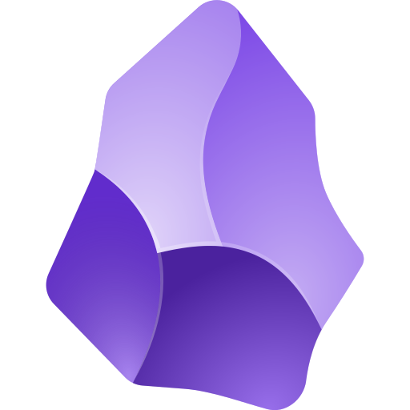
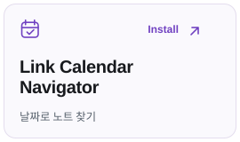
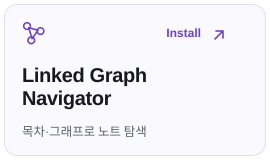
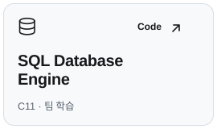
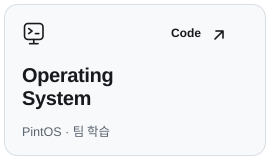
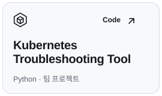

# 최우녕

직접 쓰는 개발·기록 도구를 만듭니다.

<a href="https://docs.woonyong.com/"><picture><source media="(prefers-color-scheme: dark)" srcset="assets/brand/button-wiki-dark.svg"></picture></a>

##  Obsidian tools

<a href="https://obsidian.md/plugins?id=runnable-code-blocks"><picture><source media="(prefers-color-scheme: dark)" srcset="assets/brand/cards/runnable-code-blocks-dark.svg"></picture></a>
<a href="https://obsidian.md/plugins?id=link-calendar"><picture><source media="(prefers-color-scheme: dark)" srcset="assets/brand/cards/link-calendar-dark.svg"></picture></a>
<a href="https://obsidian.md/plugins?id=linked-graph"><picture><source media="(prefers-color-scheme: dark)" srcset="assets/brand/cards/linked-graph-dark.svg"></picture></a>

## Systems projects

<a href="https://github.com/woonyong-kr/lrn-sql"><picture><source media="(prefers-color-scheme: dark)" srcset="assets/brand/cards/sql-engine-dark.svg"></picture></a>
<a href="https://github.com/woonyong-kr/lrn-pintos"><picture><source media="(prefers-color-scheme: dark)" srcset="assets/brand/cards/operating-system-dark.svg"></picture></a>
<a href="https://github.com/woonyong-kr/k8s-clue-python-reference"><picture><source media="(prefers-color-scheme: dark)" srcset="assets/brand/cards/kubernetes-dark.svg"></picture></a>

